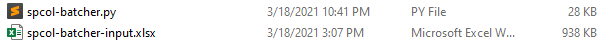
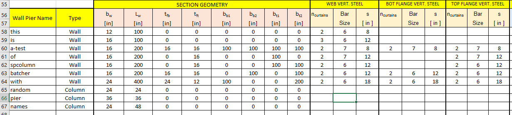
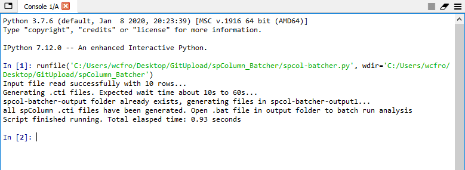
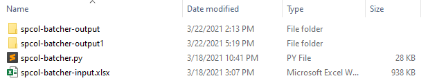
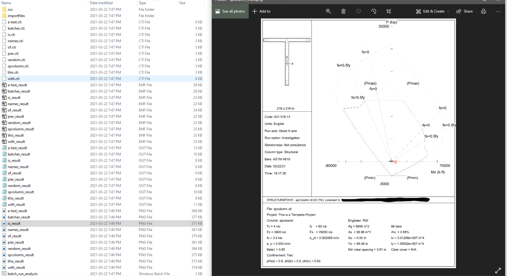

# SpColumn Batcher

spColumn is a concrete design/analysis software made by STRUCTUREPOINT. It is commonly used for strain compatibility analysis of concrete column/wall sections. Despite its versatility, the creation of individual column/wall sections, especially irregular ones, can be quite onerous.

One of the best features of the program is that it allows for users to create model files in ".cti" format; which are plain text files that can be interpreted by spColumn and modified with any text editor. Furthermore, ".cti" files can be executed in batch from the command line, allowing for tremendous flexibility in automating different workflows. 

With this script, one can generate hundreds of spColumn sections, run analysis, and export results within seconds. More information about ".cti" files and batch running analyses from StructurePoint:

https://structurepoint.org/spColumn-Online-Manual/spColumn/Chapter_4/Executing_a_Run.htm

https://structurepoint.org/spColumn-Online-Manual/spColumn/Appendix/spColumn_Text_Input_CTI_file_format.htm

## Overview of Script

The steps involved in using spColumn-Batcher is as follows:

1. Enter relevant section information into "spcol-batcher-input.xlsx" . You will find two tabs within the sheet. The "wall_info" tab is where you will enter the wall/column information. The "ETABS" tab is where you will enter the factored demands (P+M). You can create rectangular columns, or walls that is I-shaped, T-shaped, C-shaped, L-shaped, etc.

2. Save the input sheet and run "spcol-batcher.py". I am using Spyder's IPython here. 

3. Afterwards, the output files will be created in a folder called "spcol-batcher-output". If the folder already exists, the files will be outputted to "spcol-batcher-output1" and so on...

4. Within the "spcol-batcher-output" folder, you will find the following files:
   * "csv" folder containing some pickled data for reference purposes
   * "importfiles" folder containing .txt files of all sections which can be imported into spColumn individually should you decide to do that.
   * Generated ".cti" files which can be opened directly in spColumn
   * "batch_run_analysis.bat". Double click on this to batch run every spColumn file in the folder

5. [StructurePoint provides many options for batch running from command line.](https://structurepoint.org/spColumn-Online-Manual/spColumn/Chapter_4/Executing_a_Run.htm) The program is currently set up to output .emf files (which can be easily converted to .png files with (python's PIL.Image package)

## Assumptions and Other Info

* Dependencies: math, pandas, os, time, itertools
* Since the python script will query a preset range , no additional rows or columns can be added to the input spreadsheet without modifying the python script.
* Although non-planar walls can be created here, only P, Vy, and Mx will be checked. Bi-axial runs should be performed manually. Nevertheless, this tool is still good for creating the baseline models
* The script does not have much in terms of exception handling and error-checking. User-specified dimensions should make physical sense

## Disclaimer

The python script in this repo is meant to be used in conjunction with spColumn; a registered trademark of STRUCTUREPOINT LLC. 

I am NOT affiliated with STRUCTUREPOINT in any way whatsoever. All information contained herein, including codes and calculations, are publicly available (e.g. https://structurepoint.org/pdfs/manuals/spcolumn-manual.pdf). Please purchase the official spColumn software before use. No copyright infringement is intended. 

Please note that I created spColumn-Batcher over the course of a single weekend to facilitate some of my workflow. It is a one-man project and can in no way, shape or form conform to the level of debugging process at commercial software companies. In using the program, the user accepts and understands that no warranty is expressed or implied by the developers on the accuracy or the reliability of the program. The user must explicitly understand the assumptions of the program and must independently verify the results.

THE SOFTWARE IS PROVIDED "AS IS", WITHOUT WARRANTY OF ANY KIND, EXPRESS OR IMPLIED, INCLUDING BUT NOT LIMITED TO THE WARRANTIES OF MERCHANTABILITY, FITNESS FOR A PARTICULAR PURPOSE AND NONINFRINGEMENT. IN NO EVENT SHALL THE AUTHORS OR COPYRIGHT HOLDERS BE LIABLE FOR ANY CLAIM, DAMAGES OR OTHER LIABILITY, WHETHER IN AN ACTION OF CONTRACT, TORT OR OTHERWISE, ARISING FROM, OUT OF OR IN CONNECTION WITH THE SOFTWARE OR THE USE OR OTHER DEALINGS IN THE SOFTWARE.